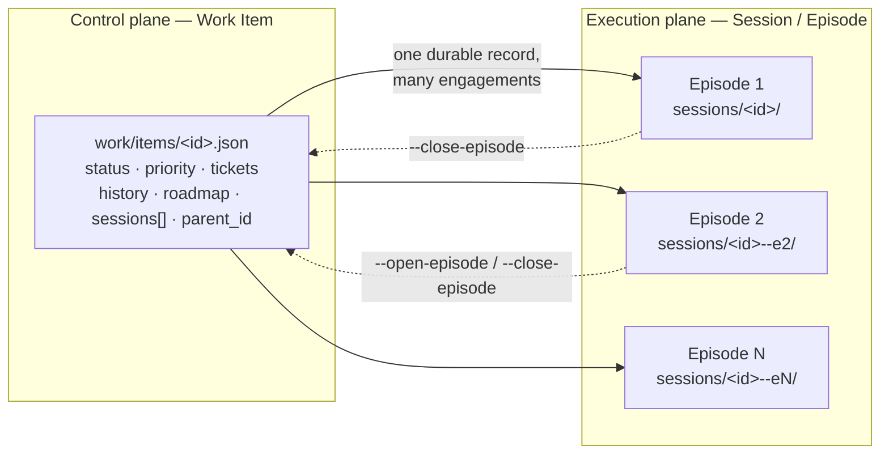
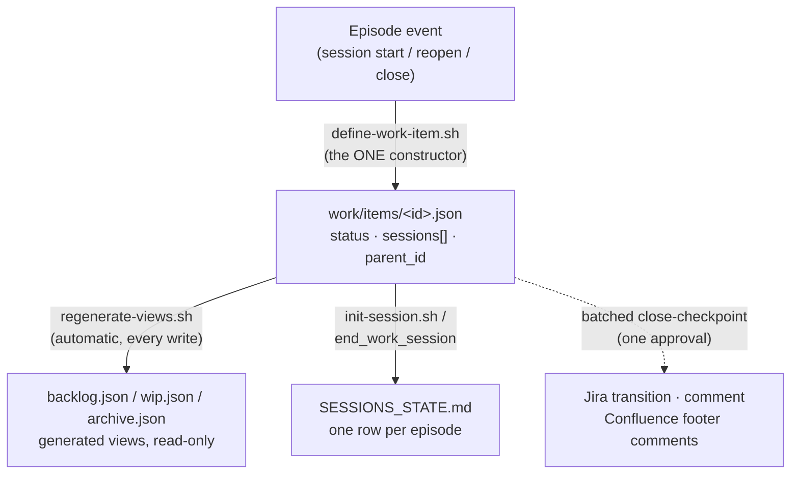
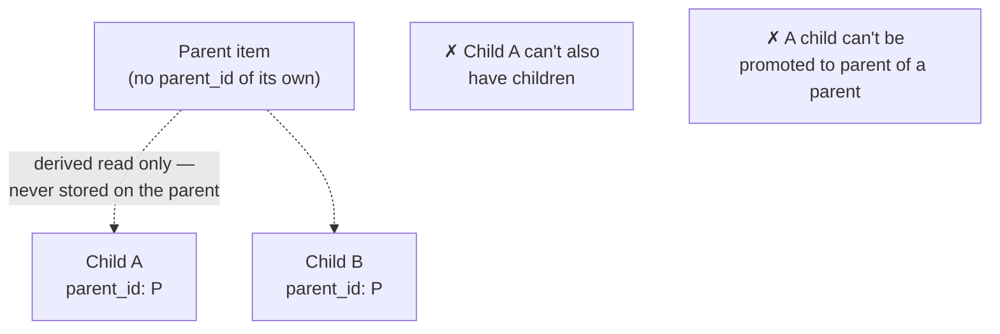

# Toolbox Architecture: Control Plane / Execution Plane

This document explains how the Agentic SDLC toolbox tracks work and runs
sessions, after the ADH-008 / ADH-011 / ADH-012 / ADH-014 / ADH-015
refactors. It's a reference for understanding the model, not a tutorial —
for step-by-step commands see [`cheatsheet.md`](cheatsheet.md).

## Before an item exists — capture and triage

Not everything starts as a Work Item. `work/INBOX.md` is the front
door — raw, unsorted lines for anything that comes in (a Slack ping, an
idea mid-meeting) before it's shaped into anything durable:

```
#capture-work → work/INBOX.md → #triage-inbox → work/items/<id>.json
```

`#capture-work` (ADH-015) is a guided, prompt-layer-only front door: a
note plus optional `--source`/`--link`, sanitized (whitespace collapsed
and trimmed) and inserted **unconditionally immediately after** the
`<!-- newest entries at the top -->` marker — pushing existing entries
down, so ordering stays newest-first regardless of how many captures
accumulate. It assigns no priority, scope, or ticket; a hand-written
bullet still works too, since `#triage-inbox` reads every line as free
text. `INBOX.md` itself stays unlocked and hand-edited — the same
low-stakes, pre-shaping status it's always had; nothing here goes through
`define-work-item.sh`'s lock or fields.

`#triage-inbox` is the actual promotion step: it reads each inbox line,
assigns priority/scope, and creates the item via `define-work-item.sh` —
the first point at which a capture becomes a real, durable Work Item.
Everything below this section describes what happens from there on.

## The core split

Everything in this toolbox is either **control plane** or **execution
plane**:

- **Control plane — the Work Item.** The durable, cross-time record of a
  piece of work: what it is, its status, priority, ticket link, history.
  One JSON file per item, `work/items/<id>.json`, living forever regardless
  of how many times it's picked up.
- **Execution plane — the Session (episode).** One bounded engagement with
  an item: a folder, a branch, one or more worktrees, a tmux session. A
  session starts, does work, and ends. An item can be picked up more than
  once — each pickup is a separate **episode**.

Before ADH-008, these were conflated: one shared `work/wip.json` file was
hand-edited by every session-lifecycle command, with no locking, no
distinction between an item's durable identity and any one engagement with
it. That model had a real, live failure — a race condition silently
dropped two active sessions from the registry. Everything below replaced
it.



## The rollup chain — one writer, one direction

The organizing principle across every piece of this design: **state flows
one direction through defined sync points.** No file is ever "kept in
agreement" with another by hand — each hop has exactly one writer, and
everything downstream is derived.



Nothing downstream of `work/items/<id>.json` is ever hand-edited. If you
find yourself about to edit `backlog.json` or `SESSIONS_STATE.md` directly,
that's the signal you're fighting the architecture — go through
`define-work-item.sh` instead.

## The per-item store and its lock

`work/items/<id>.json` — one file per item, written **only** through
`scripts/define-work-item.sh` (the shell CLI) / `scripts/lib/define_work_item.py`
(the pure shaping logic it calls). Every write acquires a per-item `mkdir`-based
lock (`work/items/<id>.json.lock/`) with PID-liveness stale-break — a crashed
writer's lock is only broken once its process is confirmed dead, never just
because time passed.

Two different items' writes never contend — they're different files, different
locks. One item's concurrent writers serialize through its own lock instead of
racing a shared read-modify-write.

**The constructor's fields, by tier:**

| Tier | Fields | Who can set them |
|---|---|---|
| Plain reshape | `title`, `description`, `status`, `priority`, `scope`, `ticket`, `parent_id` | Any caller, any time — `--triage-inbox`, `--groom-item`, `--plan-cycle`, direct calls |
| Append-only opt-in | `history` (append), `roadmap` (append) | Explicit opt-in (`--record-event`, `--roadmap-step`) — never overwritten, only ever grown. `roadmap` (ADH-014) is `{step, owner, target_date, type}`; `--roadmap-owner` is required, `--roadmap-target-date` defaults to the literal string `"TBD"` (not `""`) so `#review-backlog`'s gap heuristic still catches it |
| Session-lifecycle opt-in | `current_state`, `sessions[]`, `last_synced` | Only when the caller explicitly opts in (`--current-state`, `--open-episode`/`--close-episode`, `--last-synced`) — an ordinary reshape call can never clobber these |

That split is deliberate: it's what makes it safe for `#plan-cycle` to
casually flip an item's `priority` without any risk of silently wiping its
`history`.

## Generated views

`backlog.json`, `wip.json`, `archive.json` are **derived**, not
independent state. `regenerate-views.sh` runs automatically after every
`define-work-item.sh` write and rebuilds all three from a full scan of
`work/items/*.json`, partitioning by status:

| Status | View |
|---|---|
| `grooming`, `ready` | `backlog.json` |
| `in progress`, `on hold`, `in review` | `wip.json` |
| `done` | `archive.json` |

Each view entry is intentionally thin — `{title, status, priority, scope}`
only. `history`, `current_state`, `roadmap`, `sessions[]`, `parent_id` live
only in the item's own file. Commands that need those fields (`#groom-item`,
`#review-backlog`, `#review-wip`) read the view for the id list, then the
item file for detail — a documented two-hop read, not an oversight.

## Episode identity — reopening a done item

An item's `status` reaching `done` only happens one way: `#end_work_session`
calling `--close-episode <session-id> --outcome done`. Nothing else ever
sets `status: done` — which is also what finally lets `regenerate-views.sh`
move an item into `archive.json`.

Once an item is `done` / `on hold` / `in review`, picking it back up is a
**reopen**, not a fresh session:

```mermaid
sequenceDiagram
    participant U as start-work-session
    participant I as init-session.sh
    participant C as define-work-item.sh
    participant F as work/items/&lt;id&gt;.json

    U->>F: check status of candidate id
    Note over U: done/on-hold/in-review →<br/>offer to reopen
    U->>I: --reopen-item &lt;id&gt;
    I->>F: read sessions[], compute max(episode_number)+1
    I->>I: session id = &lt;id&gt;--eN
    I->>C: --open-episode &lt;id&gt;--eN
    C->>F: append sessions[] entry, status → in progress
    Note over F: item file is NEVER duplicated —<br/>always work/items/&lt;id&gt;.json, no --eN suffix
```

- **Episode 1 is always implicit** — the item id itself, no `--eN` suffix,
  no migration needed for anything that predates this feature.
- **`sessions[]` entries**: `{episode_id, episode_number, folder, opened,
  closed, outcome}`. Empty until an item's first reopen or close event
  populates it; a structurally-empty array is lazily backfilled from
  `history` the first time it's needed.
- Every command that resolves an item from a session id strips a trailing
  `--eN` suffix first — the item file is always `work/items/<item-id>.json`,
  never per-episode.

## Work Item hierarchy — sub-items / epics

Items can have a parent/child relationship — epic-like grouping — exactly
**one level deep**.



- **`parent_id` lives only on the child.** "Children of X" is always a
  scan of `work/items/*.json` for `parent_id == X`, computed on demand by
  `#groom-item`/`#plan-cycle`/`#review-backlog` — never stored on the
  parent. This is what makes de-aggregation (`--promote`) a single-field
  write instead of a two-file transaction.
- **Exactly one level** — a child can't itself be a parent, a parent can't
  itself be a child. Enforced by `validate_parent_link` before any write;
  cycles are impossible by construction.
- **A second, shared lock** (`work/items/.parent-link.lock/`) serializes
  every `--parent`/`--promote` call across the *whole* item store — not
  just per-item. This exists because the one-level invariant spans two
  different items' files; a per-item lock alone can't protect a two-file
  invariant. Ordinary reshape calls never touch this lock.
- No automatic rollup: a parent's own `status`/`roadmap` is never derived
  from its children. Commands show a read-only roll-up count
  ("3/5 sub-items done") — a human decides what it means.

## Ad hoc maintenance — `#define-work-item` and the two-tier guardrail

`scripts/define-work-item.sh` was always the *only* constructor, but until
ADH-014 it had no guided front door of its own — every session/backlog
ceremony called it internally, and a one-off fix (a stuck item, a
correction, recording a `roadmap` step) meant improvising a raw script
call from first principles. `#define-work-item` closes that: bare shows
an item's full current state; flagged shows current-vs-proposed and
confirms before applying — same "read before you write" discipline every
other command already follows.

Some flags here are lifecycle-adjacent — they do something a ceremony
command (`start-work-session`, `#end_work_session`) *also* does, just
without that command's extra bookkeeping. This toolbox now has an
established two-tier pattern for that class of flag, worth reusing
whenever a similar case comes up:

| Tier | Enforced where | Example | Behavior |
|---|---|---|---|
| **Tier 1 — hard refusal** | In `define-work-item.sh` itself, for *every* caller, not just the prompt command | `--status done` while the item's last episode is still open | Refused outright — this specific combination is genuine data corruption (archives the item with an un-reopenable open episode), not just a skipped convenience |
| **Tier 2 — warn + confirm** | Prompt-layer only (`#define-work-item`) | `--status "in progress"`, `--open-episode`, `--close-episode` bypassing the close-checkpoint | Never blocks — names the ceremony command and what it additionally does, requires a **genuine human confirmation** per `AGENTS.md`'s Approval Protocol, never agent-inferred |

The line between the two tiers is deliberately narrow: **corruption vs.
convenience.** Only one Tier 1 case exists today — no generalized "which
flags are which tier" policy engine was built for a set of one; add a new
Tier 1 case only when a flag combination can actually corrupt state, not
merely skip a nice-to-have step.

The Tier 1 check is a good worked example of the lock-ordering discipline
this toolbox already uses elsewhere (see the hierarchy section above): it
runs **after** `define-work-item.sh` acquires the item's own lock,
immediately before the write — not as a separately-timed pre-lock read,
which would reopen the exact race it exists to close.

### A hard-won convention: never interpolate into inline `python3 -c` source

Both the Tier 1 check and the pre-existing `--parent`/`--promote`
validation calls build a small inline Python script inside
`define-work-item.sh`. Building that source by interpolating a shell
variable directly into the Python string (`f"...{item_id}..."` via bash
`"$VAR"` substitution) is **not just a style nit — it's arbitrary code
execution.** A Gate B reviewer demonstrated this for real: a crafted item
id containing `'+__import__('os').system(...)+'` broke out of the string
literal and ran. The same pattern, already present in `--parent`/
`--promote` and predating this finding, was exploitable the same way.

Both were fixed the same way, now the standing convention for any new
inline Python in this script: **pass values through the environment and
read them with `os.environ`**, never interpolate into the source text.
The main `define_item()` write call already did this — the fix was
extending its own already-correct pattern to the newer call sites, not
inventing something new.

## Gates — human-in-the-loop

Every non-trivial change to this toolbox goes through two gates, reviewed
by a fresh-context `reviewer` subagent (no anchoring on the author's
rationale) before a human signs off:

| Gate | When | What it checks |
|---|---|---|
| **Gate A** | Before implementation | The design (`SPEC.md`) — interfaces, contracts, concurrency, out-of-scope lines |
| **Gate B** | Before merge | The actual diff against the (possibly-revised) design |

Both gates are argued critiques with severities and citations, never a bare
pass/fail — and they've caught real bugs in this exact codebase:

- Two separate concurrency races (episode numbering, and the hierarchy
  one-level invariant) that "looked" correct on first read.
- ADH-014's Tier 1 check: a Gate B reviewer didn't just review the diff,
  it *exploited* it — crafting an item id that broke out of an inline
  `python3 -c` string and ran arbitrary code, then found the identical,
  already-shipped pattern in `--parent`/`--promote` and fixed both (see
  the convention above).
- ADH-015's `#capture-work`: round 2 caught a genuine ordering bug in the
  *round-1 fix itself* — "insert after the marker, or after the last
  entry" inverts newest-at-top ordering from the second capture onward.
  Caught by hand-tracing before a line of the command was written.

The recurring lesson across all of these: an author's own
confident-sounding correction is exactly the kind of claim a
fresh-context reviewer exists to check, not take on faith — including the
reviewer's own second-round pass over its first-round fix.

## External systems — batched, never piecemeal

Jira and Confluence writes never happen scattered through a session.
`#end_work_session`'s step 4b assembles the **entire** batch — the full
planned Jira transition chain (re-verified hop-by-hop immediately before
each fires), one consolidated comment, and any Confluence footer
comments — and asks for **one** approval covering all of it. A declined
batch changes nothing; the same delta re-proposes next close.

## Where to go next

- [`cheatsheet.md`](cheatsheet.md) — every command and script flag, by task
- `.agents/rules/session-state.instructions.md` — the file-by-file update
  discipline
- `.agents/rules/dev-lifecycle.instructions.md` — the full Gate A/B pipeline
- `02-adrs/` — the Architecture Decision Records this design is built on
  (0001 tiered rule loading, 0002 per-session isolation, 0003 reconciling
  0002 with the item store)
